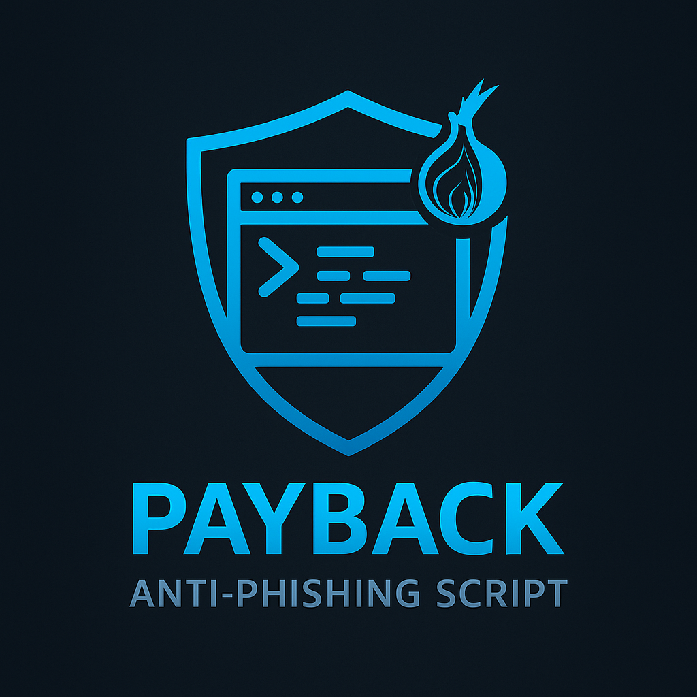

# Payback Script Anti-Phishing 🛡️

Este script automatiza el envío masivo de credenciales falsas a sitios de phishing, con el objetivo de saturar sus bases de datos y sabotear a los delincuentes.

---

## ⚙️ Requisitos

- Python 3.13+
- [Playwright](https://playwright.dev/python/)
- [Fake User Agent](https://pypi.org/project/fake-useragent/)
- (Opcional) Tor instalado y ejecutándose para navegación anónima

---

## ✅ Probado en

- Kali Linux
- Ubuntu 24.04
- Fedora 42

---

## 🚀 Instalación

```bash
pip install -r requirements.txt
python -m playwright install
```

---

## 🧠 Características

- ✅ **Detección automática inteligente de campos de formulario**
  - Analiza atributos como `name`, `id`, `class`, `placeholder`, `aria-label`
  - Soporte para `input`, `email`, `tel`, `password`, `textarea` y más
- ✅ **Detección extendida de botones**
  - Captura `button`, `input[type=submit]`, `div[role=button]`, `onclick`
- ✅ **User-Agent rotativo realista**
  - Basado en `fake-useragent` con selección aleatoria entre dispositivos y navegadores
- ✅ **Soporte Tor (opcional)**
  - Detecta automáticamente si se debe usar Tor y enruta por proxy SOCKS5
- ✅ **Recarga del formulario tras cada envío**
  - Asegura que el formulario esté siempre limpio para seguir enviando
- ✅ **Detección de bloqueos por navegador**
  - Si el formulario desaparece (por bloqueo o redirección), el script se detiene con aviso claro
- ✅ **Diagnóstico automático si falla la detección**
  - Muestra todos los campos `input` y botones visibles para facilitar análisis

---

## 🧪 Uso

```bash
python payback.py
```

El script le solicitará la URL del sitio falso donde se encuentra el formulario. Cuando se la dé, Payback comenzará a enviar credenciales falsas de forma continua e ininterrumpida. Puede detener el ataque con `Ctrl + C`.

---

## 📌 Notas

- Si el sitio es bloqueado por navegadores (Cloudflare, Firefox, Chrome), puede reiniciar el túnel o cambiar el dominio.
- El script detecta automáticamente si el formulario fue bloqueado y se detiene de forma segura.

---

## 🖼️ Capturas de pantalla

(Agregá acá tus imágenes si querés visuales del script en acción)

---

## 💬 Contribuciones

Si quiere ayudar a mejorar el script, agregar nuevos modos o integraciones (VPN, CAPTCHA, etc.), siéntase libre de modificarlo a su gusto. ¡Todas las mejoras son bienvenidas!
